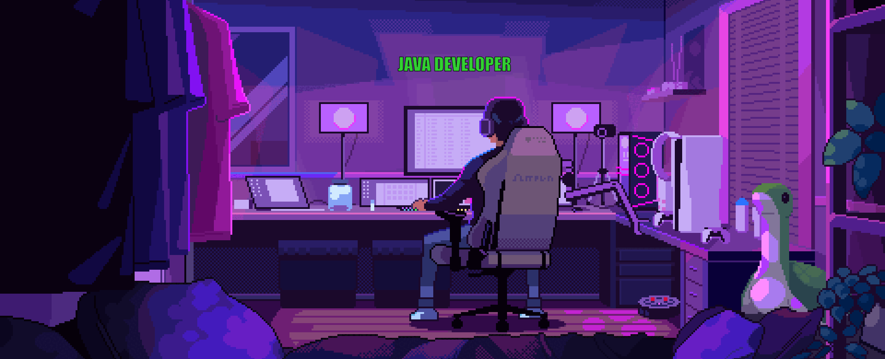

# 💫 About Me:
🔭 I’m currently working on 👯 I’m looking to collaborate on 🤝 I’m looking for help with 🌱 I’m currently learning 💬 Ask me about ⚡ Fun fact

## 🌐 Socials:
 

# 💻 Tech Stack:
            
# 📊 GitHub Stats:
 
 

---

<!-- Proudly created with GPRM ( https://gprm.itsvg.in ) -->
